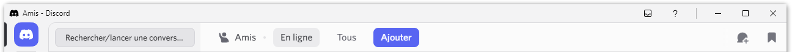
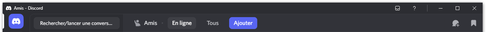
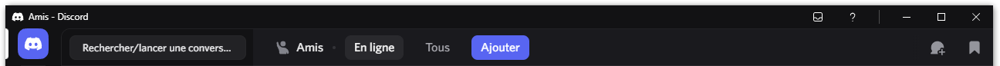
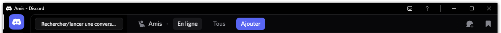
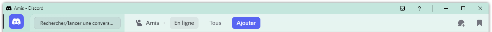
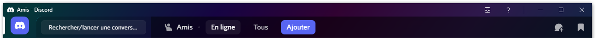
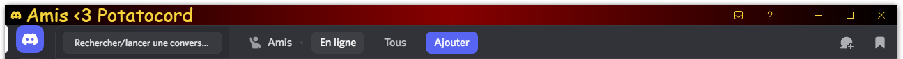
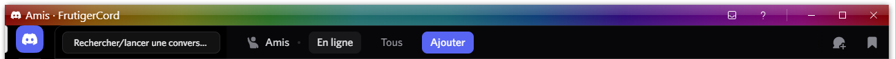

# Windows 10/11-ish Titlebar

A theme that replicates a Windows 10/11 lookalike titlebar. Can be used standalone or as part of a theme.
It uses the existing elements from the titlebar (like the server indicator at the top) to replicated efficiently the Windows 10/11 titlebar design, without adding any unnecessary elements to it.

## Features

- Personnalizable elements:
  - Font
  - Font size
  - Font boldness
  - Appended text ("- Discord")
  - Background color (gradients are supported)
  - Caption elements' color (Light and dark-toned themes have separate setting)

## Compatibility

As this theme was primarily designed for Windows, it is likely only compatible with it.

It does work with all themes officially included into Discord (both Non-Nitro and Nitro-exclusive).


<sup>*Preview with Light Theme*</sup>

<sup>*Preview with Ash Theme*</sup>

<sup>*Preview with Dark Theme*</sup>

<sup>*Preview with Onyx Theme*</sup>

<sup>*Preview with "Mint Apple" Theme*</sup>

<sup>*Preview with "Chroma Glow" Theme*</sup>

As the theme is customizable, you can do everything you want!<br>For example:


<sup>*Preview of a goofy style with the following modifications to the base settings:*</sup>
```css
:root {
    --titleFont: "Comic Sans MS";
    --titleSize: 20pt;
    --titleBoldness: normal;
    --titleAfterDashText: "Potatocord";
    --titleDashText: "<3";

    --titleBarColor: linear-gradient(90deg, #000000, #880000, #000000);
    --CaptionBarItemColor: #f7d53b;
    --LTCaptionBarItemColor: #000000;

}
```

or…


<sup>*Preview of a glossy rainbow theme with the following modifications to the base settings:*</sup>
```css
:root {
    --titleFont: "Segoe UI";
    --titleSize: 12pt;
    --titleBoldness: normal;
    --titleAfterDashText: "FrutigerCord";
    --titleDashText: "·";

    --titleBarColor: linear-gradient(180deg, #ffffff44 0%, #ffffff22 50%, #ffffff00 50%, #ffffff11 100%), linear-gradient(90deg, rgba(255,0,0,0.5) 0%, rgba(255,154,0,0.5) 10%, rgba(208,222,33,0.5) 20%, rgba(79,220,74,0.5) 30%, rgba(63,218,216,0.5) 40%, rgba(47,201,226,0.5) 50%, rgba(28,127,238,0.5) 60%, rgba(95,21,242,0.5) 70%, rgba(186,12,248,0.5) 80%, rgba(251,7,217,0.5) 90%, rgba(255,0,0,0.5) 100%);
    --CaptionBarItemColor: #ffffff;
    --LTCaptionBarItemColor: #000000;

}
```

## "Can I integrate it into my project?"

You can, just add the following to your CSS:
```css
@import url("https://kiki79250coc.github.io/BetterDiscordAddons/Themes/Win10ishTitlebar/ThemeLoader_v1.0.2/Core0.css");

:root {
    --titleFont: "Segoe UI";
    --titleSize: 9pt;
    --titleBoldness: normal;
    --titleAfterDashText: "Discord";
    --titleDashText: "-";

    --titleBarColor: transparent;
    --CaptionBarItemColor: #ffffff;
    --LTCaptionBarItemColor: #000000;

}
```

## "Ideas for the future?"
Maybe yes, as there's certainly some things I want to add to it like ability to hide inbox/support buttons, ability to put the text to the center like in Windows 8.x

You know, this kind of things…


-----

Copyright © 2025 AstragonQC<br><sup>All rights reserved.</sup>

